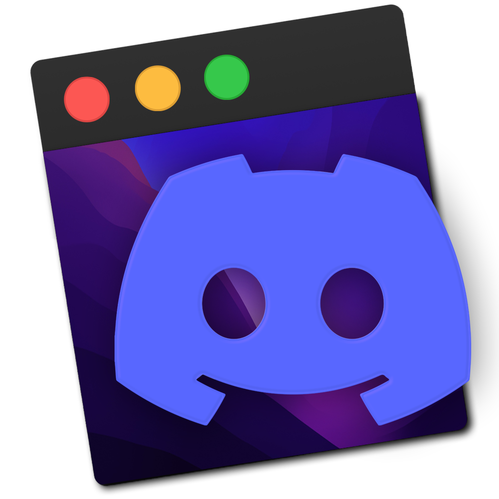
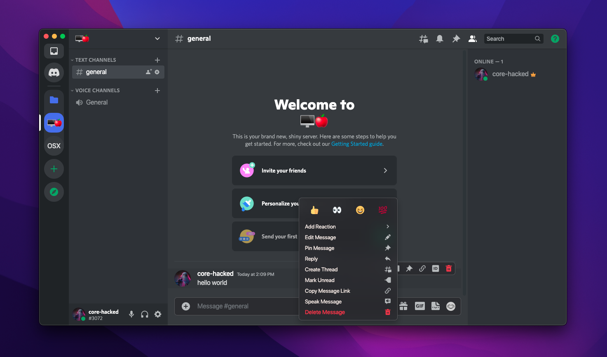
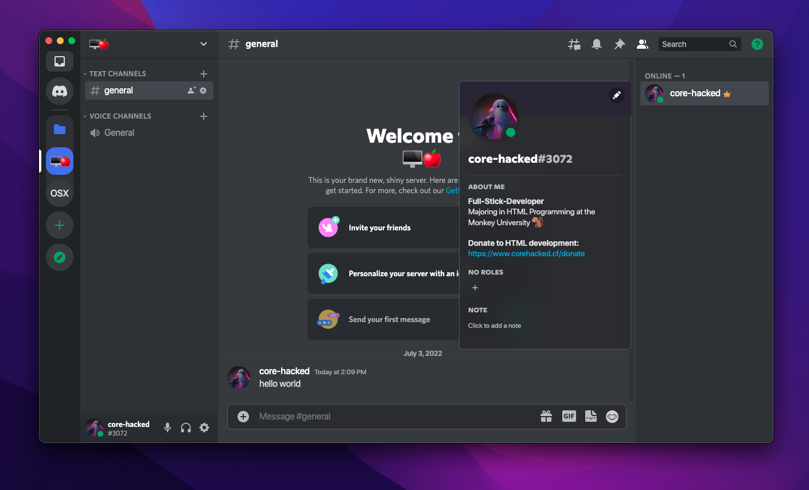
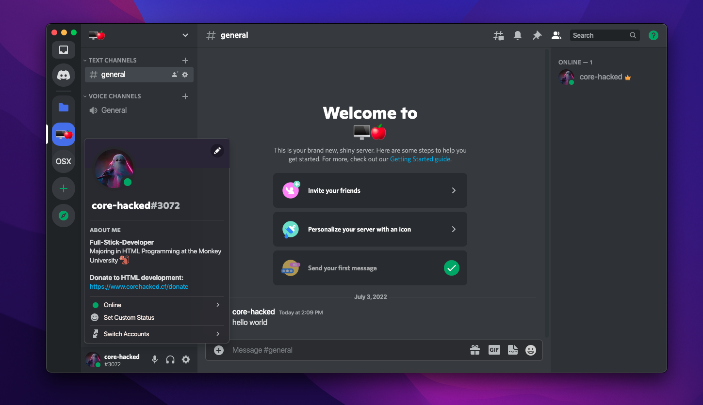
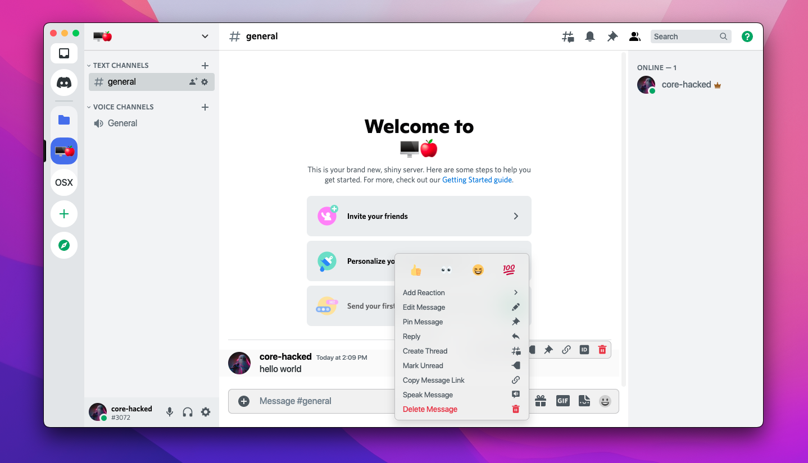
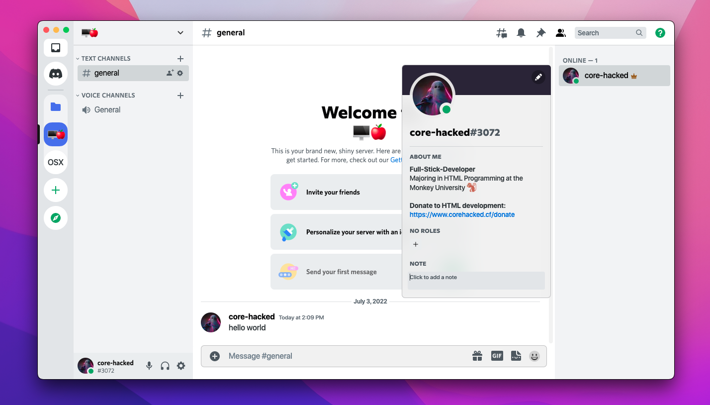
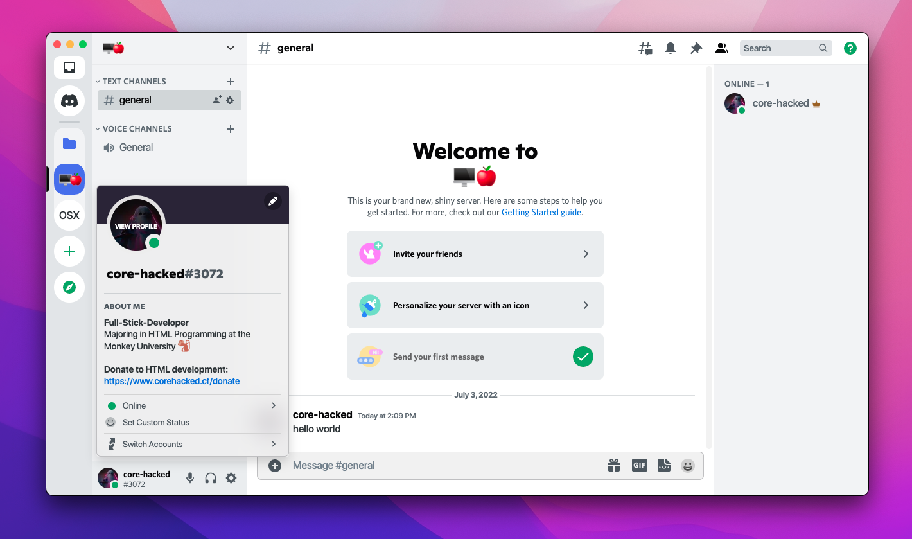

[![Contributors][contributors-shield]][contributors-url]
[![Forks][forks-shield]][forks-url]
[![Stargazers][stars-shield]][stars-url]
[![Issues][issues-shield]][issues-url]
[![MIT License][license-shield]][license-url]

<!-- PROJECT LOGO -->
<br />
<p align="center">
  <a href="https://github.com/core-hacked/BetterDiscord-MacOS-Theme">
    
  </a>

  <h3 align="center">BetterDiscord MacOS Theme</h3>

  <p align="center">
    MacOS Styled popouts, dialogs and more. A modernized/edited version of <a href="https://betterdiscord.app/theme/OSX">TheCommieAxolotl's OSX Theme</a>
    <br />
    <a href="https://github.com/core-hacked/BetterDiscord-MacOS-Theme/issues">Report Bug</a>
    ·
    <a href="https://github.com/core-hacked/BetterDiscord-MacOS-Theme/issues">Request Feature</a>
  </p>
</p>


<!-- TABLE OF CONTENTS -->
<details open="open">
  <summary><h2 style="display: inline-block">Table of Contents</h2></summary>
  <ol>
    <li>
      <a href="#theme-preview">Theme Preview</a>
      <ul>
        <li><a href="#dark-mode">Dark Mode</a></li>
        <li><a href="#light-mode">Light Mode</a></li>
      </ul>
    </li>
    <li>
      <a href="#getting-started">Getting Started</a>
      <ul>
        <li><a href="#prerequisites">Prerequisites</a></li>
        <li><a href="#installation">Installation</a></li>
      </ul>
    </li>
    <li><a href="#roadmap">Roadmap</a></li>
    <li><a href="#contributing">Contributing</a></li>
    <li><a href="#license">License</a></li>
    <li><a href="#contact">Contact</a></li>
  </ol>
</details>

<br/>

<!-- THEME PREVIEW -->
## Theme Preview

### Dark Mode

 <br/>
 <br/>
 <br/>

### Light Mode

 <br/>
 <br/>
 <br/>
 
<br/>


<!-- GETTING STARTED -->
## Getting Started

To install/add the theme to BetterDiscord, follow the steps below.

### Prerequisites

* BetterDiscord

* SF PRO Display Font
  * [MacOS](https://developer.apple.com/fonts/)
  * [Linux/Windows](https://github.com/blaisck/sfwin) <br/>
  
  
### Installation

1. Clone the repo
   ```sh
   git clone https://github.com/core-hacked/BetterDiscord-MacOS-Theme.git
   ```
2. Copy the theme into your BetterDiscord/themes folder
* MacOS
    ```sh
    cp ~/Downloads/BetterDiscord-MacOS-Theme-master/MacOS.theme.css ~/Library/Application\ Support/BetterDiscord/themes/
    ```
 * Linux
    ```sh
    cp ~/Downloads/BetterDiscord-MacOS-Theme-master/MacOS.theme.css ~/.config/BetterDiscord/themes/
    ```

* Windows
   ```bat
   copy %USERPROFILE%\Downloads\BetterDiscord-MacOS-Theme\MacOS.theme.css %AppData%\BetterDiscord\themes\
   ```

<!-- ROADMAP -->
## Roadmap

See the [open issues](https://github.com/core-hacked/BetterDiscord-MacOS-Theme/issues) for a list of proposed features (and known issues).


<!-- CONTRIBUTING -->
## Contributing

Contributions are what make the open source community such an amazing place to be... learn, inspire, and create. Any contributions you make are **greatly appreciated**.

1. Fork the Project
2. Create your Feature Branch (`git checkout -b feature/AmazingFeature`)
3. Commit your Changes (`git commit -m 'Add some AmazingFeature'`)
4. Push to the Branch (`git push origin feature/AmazingFeature`)
5. Open a Pull Request


<!-- LICENSE -->
## License

Distributed under the MIT License. See `LICENSE` for more information.


<!-- CONTACT -->
## Contact

[info@corehacked.com](mailto:info@corehacked.com)


<!-- MARKDOWN LINKS & IMAGES -->
<!-- https://www.markdownguide.org/basic-syntax/#reference-style-links -->
[contributors-shield]: https://img.shields.io/github/contributors/core-hacked/BetterDiscord-MacOS-Theme.svg?colorA=1e1e28&colorB=E38C8F&style=for-the-badge&logo=starship%20style=for-the-badge
[contributors-url]: https://github.com/core-hacked/BetterDiscord-MacOS-Theme/graphs/contributors
[forks-shield]: https://img.shields.io/github/forks/core-hacked/BetterDiscord-MacOS-Theme.svg?colorA=1e1e28&colorB=A4B9EF&style=for-the-badge&logo=starship%20style=for-the-badge
[forks-url]: https://github.com/core-hacked/BetterDiscord-MacOS-Theme/network/members
[stars-shield]: https://img.shields.io/github/stars/core-hacked/BetterDiscord-MacOS-Theme.svg?colorA=1e1e28&colorB=EBDDAA&style=for-the-badge&logo=starship%20style=for-the-badge
[stars-url]: https://github.com/core-hacked/BetterDiscord-MacOS-Theme/stargazers
[issues-shield]: https://img.shields.io/github/issues/core-hacked/BetterDiscord-MacOS-Theme.svg?colorA=1e1e28&colorB=B1E3AD&style=for-the-badge&logo=starship%20style=for-the-badge
[issues-url]: https://github.com/core-hacked/BetterDiscord-MacOS-Theme/issues
[license-shield]: https://img.shields.io/github/license/core-hacked/BetterDiscord-MacOS-Theme.svg?colorA=1e1e28&colorB=F9C096&style=for-the-badge&logo=starship%20style=for-the-badge
[license-url]: https://github.com/core-hacked/BetterDiscord-MacOS-Theme/blob/master/LICENSE.txt
